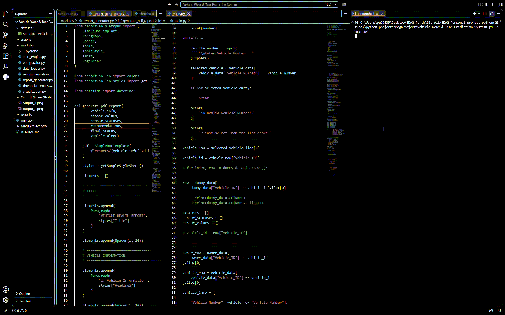
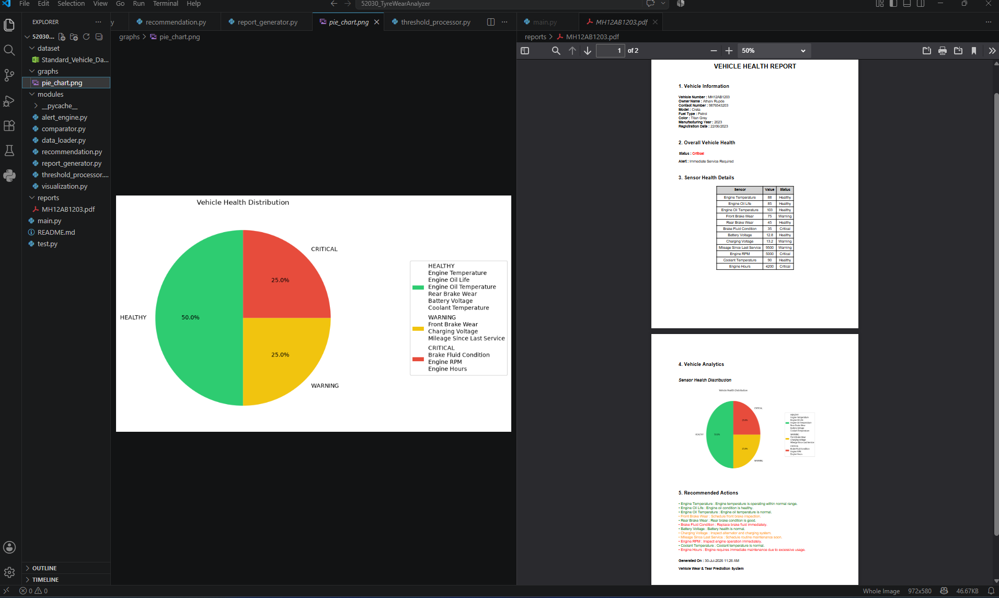
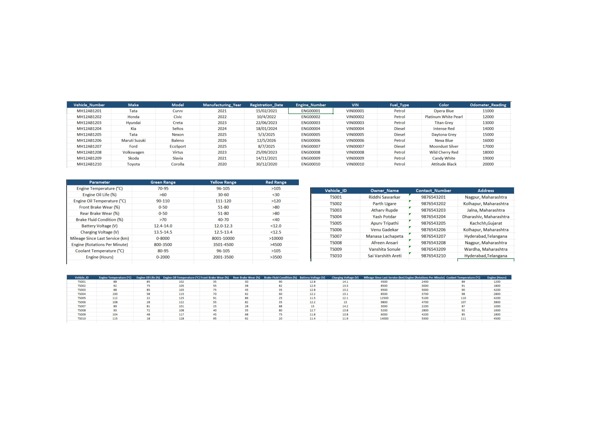

# 🚗 Vehicle Wear & Tear Prediction System

## 👥 Team Details

| Field | Details |
|-------|---------|
| Employee 1 | Parth Ugare |
| Employee ID | 52030 |
| Employee 2 | Riddhi Sawarkar |
| Employee ID | 52022 |
| Project Type | Mega Project |

---

## 📌 Project Name

**Vehicle Wear & Tear Prediction System**

---

## 📖 Project Description

Vehicle Wear & Tear Prediction System is a Python-based analytics application that analyzes vehicle operational and sensor data to evaluate the health of various vehicle components. The system compares collected data with predefined threshold values, predicts wear and tear conditions, generates maintenance alerts, provides service recommendations, visualizes vehicle health, and creates detailed PDF reports.

The project demonstrates real-world automotive data analysis techniques and provides a simple predictive maintenance solution using Python.

---

# 🎬 Live Project Demonstration

The following GIF demonstrates the complete execution flow of the application.

- Loading Dataset
- Processing Vehicle Data
- Comparing Threshold Values
- Predicting Wear & Tear
- Generating Recommendations
- Creating Pie Chart
- Generating PDF Report



---

# 📄 Generated Vehicle Report

After completing the analysis, the application automatically generates a PDF report containing:

- Vehicle Information
- Sensor Analysis
- Wear Prediction
- Alert Status
- Maintenance Recommendation

The application automatically generates graphical visualization for easier understanding of vehicle health.



---

# 📊 Dataset Used

The application uses an Excel dataset containing operational vehicle parameters for analysis.

### Dataset Preview



---

## 🎯 Objectives

- Analyze vehicle operational data.
- Detect abnormal vehicle component conditions.
- Predict wear and tear of critical vehicle parts.
- Generate maintenance alerts.
- Recommend servicing actions.
- Visualize vehicle health using graphs.
- Generate professional PDF reports.

---

## ✨ Features

- 📊 Load vehicle sensor data from Excel dataset
- ⚙️ Process and validate vehicle parameters
- 📈 Compare values with predefined thresholds
- 🚨 Detect abnormal vehicle conditions
- 🔔 Generate vehicle health alerts
- 🛠 Recommend maintenance actions
- 📉 Create graphical visualizations
- 📄 Generate downloadable PDF reports
- 📂 Modular Python project architecture

---

## 🛠 Technologies Used

| Technology | Purpose |
|------------|----------|
| Python | Programming Language |
| Pandas | Data Processing |
| OpenPyXL | Excel Handling |
| Matplotlib | Data Visualization |
| ReportLab | PDF Report Generation |
| File Handling | Data Storage |

---

## 📂 Project Structure

```text

52030_52022_VehicleWearPredictor

│
├── dataset
│      └── Standard_Vehicle_Data.xlsx
│
├── modules
│      ├── data_loader.py
│      ├── comparator.py
│      ├── threshold_processor.py
│      ├── recommendation.py
│      ├── alert_engine.py
│      ├── report_generator.py
│      └── visualization.py
│
├── graphs
│      └── pie_chart.png
│
├── reports
│      └── MH12AB1203.pdf
│
├── media
│      ├── workflow.png
│      ├── demo.gif
│      ├── dataset.png
│      ├── report.png
│      ├── output1.png
│      └── output2.png
│
├── main.py
│
└── README.md

```

---

## 🔄 Project Workflow

```
The following workflow illustrates the complete execution flow of the application.

                 🚗 Vehicle Wear & Tear Prediction System

                             ┌───────────────┐
                             │  Start System │
                             └───────┬───────┘
                                     │
                                     ▼
                      ┌───────────────────────────┐
                      │ Load Vehicle Dataset      │
                      │ (Excel File)              │
                      └─────────────┬─────────────┘
                                    │
                                    ▼
                    ┌─────────────────────────────┐
                    │ Read Vehicle Sensor Values  │
                    │ (Engine, Brake, Tyre etc.)  │
                    └─────────────┬───────────────┘
                                  │
                                  ▼
                  ┌────────────────────────────────┐
                  │ Compare with Standard Threshold│
                  └──────────────┬─────────────────┘
                                 │
                                 ▼
                  ┌────────────────────────────────┐
                  │ Calculate Wear & Health Status │
                  └──────────────┬─────────────────┘
                                 │
               ┌─────────────────┴─────────────────┐
               │                                   │
               ▼                                   ▼
      Healthy Vehicle                      Fault Detected
               │                                   │
               ▼                                   ▼
     No Service Required              Generate Alerts &
                                      Maintenance Advice
               │                                   │
               └──────────────┬────────────────────┘
                              ▼
               ┌────────────────────────────┐
               │ Generate Charts            │
               │ (Pie / Bar Graph)          │
               └─────────────┬──────────────┘
                             ▼
               ┌────────────────────────────┐
               │ Generate PDF Report        │
               └─────────────┬──────────────┘
                             ▼
                    ┌──────────────────┐
                    │      End         │
                    └──────────────────┘
```

---

# ▶️ How to Run the Project

## Step 1

Clone the repository.

```bash
git clone <https://gitlab.edag.de/kk99314/pythonbatch2projects.git>
```

---

## Step 2

Navigate to the project folder.

```bash
cd Vehicle Wear & Tear Prediction System
```

---

## Step 3

Install required libraries.

```bash
pip install pandas matplotlib openpyxl reportlab
```

---

## Step 4

Run the application.

```bash
python main.py
```

---

## 📊 Input

- Vehicle operational dataset (.xlsx)

---

##  📌 Expected Output

The application will automatically:

- Load Vehicle Dataset
- Analyze Sensor Data
- Predict Wear & Tear
- Generate Alerts
- Recommend Maintenance
- Create Pie Chart
- Generate PDF Report

---

## 🚀 Future Enhancements

- Machine Learning based wear prediction
- Real-time vehicle sensor integration
- OBD-II device connectivity
- Dashboard using Streamlit
- Cloud database integration
- Email and SMS maintenance alerts
- Historical vehicle performance tracking

---

## 🌟 Project Highlights

- Automotive domain-based project
- Predictive maintenance concept
- Modular architecture
- Data analysis and visualization
- Automated report generation
- Real-world vehicle health monitoring workflow

---

# 🙏 Acknowledgement

This project was developed as part of the **Python Mega Project** during the **EDAG Python Training Program** to demonstrate practical implementation of Python programming, modular application development, data analysis, visualization, and automated report generation.

---

## 👨‍💻 Team Members

### Parth Ugare

Employee ID: **52030**

### Riddhi Sawarkar

Employee ID: **52022**

---